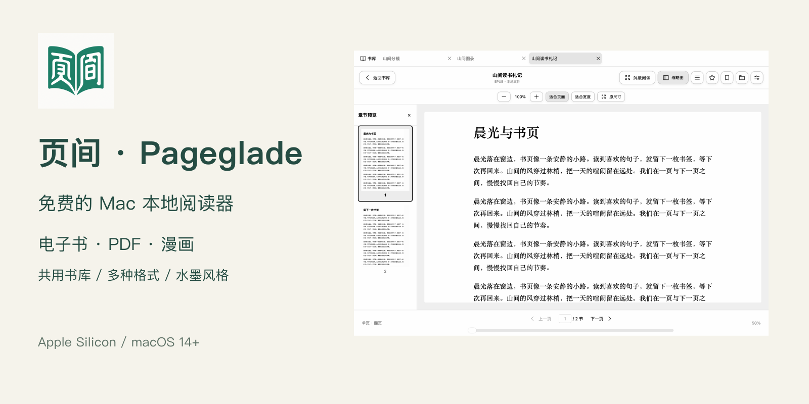

# 页间 · Pageglade

**免费的 macOS 本地阅读器：电子书、PDF、漫画共用一个书库，支持多种文件格式与黑白水墨阅读主题。**

由 TaylorWang 开发。无需注册阅读账号，书籍与阅读记录保存在本机。

## 下载与安装

**[下载 Pageglade 1.0.4](https://github.com/yuwang4321/Pageglade/releases/tag/v1.0.4)**

适用于 **Apple Silicon Mac（M1 及后续）与 macOS 14+**，当前不提供 Intel Mac 安装包。

1. 在发布页 Assets 中下载 `Pageglade-1.0.4-arm64.dmg`，不要下载自动生成的 Source code 压缩包。
2. 退出旧版，打开 DMG，将 **Pageglade** 拖入 Applications；已有版本选择替换。
3. 首次打开前阅读 **[安装说明](INSTALL.md)**。当前尚未做 Developer ID 发布签名和 Apple 公证，也未上架 App Store；确认来源并核对 SHA-256 后，按安装说明处理系统提示。无需关闭系统安全保护。

## 1.0.4 更新

- 修复从翻页切换到滚动后，前面的页面无法通过滚动查看的问题。
- 向上、向下滚动自动接续页面，无需手动调整页数或选择下一组。
- 改善切换浏览方式、跳转和重新打开书籍时的位置恢复。
- 包含此前修复的 PDF / 漫画启动白屏和阅读布局切换问题。

查看 **[完整更新说明](CHANGELOG.md)**。本版为 1.0.4（build 22），提供 DMG、SHA-256 校验文件和安装说明。

## 四个特点

| 特点 | 可以做什么 |
|---|---|
| 一个本地书库 | 电子书、PDF、漫画统一收藏、添加标签、查看历史和继续阅读 |
| 多种文件格式 | PDF、EPUB、TXT、无 DRM MOBI/AZW/AZW3/PRC，漫画压缩包与图片文件夹 |
| 免费 macOS 应用 | 免费使用，无需注册阅读账号，阅读数据保存在本机 |
| 黑白水墨主题 | 白底黑字、图片灰阶，类似 Kindle 的黑白阅读风格；属于软件显示主题 |

支持单页/双页、翻页/滚动、缩略图、章节目录、缩放与原尺寸、多文件标签页和沉浸阅读。新书继承默认阅读设置，调整后自动记住本书配置。书签与目录分开管理，支持跳转、删除与返回跳转前的位置。另有古籍竖排、轮换纸纹与淡化印章风格。

### 支持格式

- 电子书与文档：PDF、EPUB、TXT、无 DRM 的 MOBI、AZW、AZW3、PRC。
- 漫画与图片：ZIP/CBZ、RAR/CBR、7Z/CB7、图片文件夹。
- 其他：FB2，以及 HTML、RTF、DOCX 的文字读取；复杂排版可能丢失。

本地发行版内置 calibre，Kindle 格式直接解析正文、图片和封面，不转成 EPUB；FB2 在本地转换。无需另行安装 calibre。相关许可与对应版本源码随 DMG 提供。

## 已知限制

不支持 DRM、KFX、DJVU、CHM、AZW4；没有 OCR 或云同步。扫描页没有可搜索正文。复杂书籍、异常文件可能有兼容性问题。水墨为显示主题，不是电子墨水屏硬件，也不承诺护眼效果。

## 反馈

欢迎通过 **[Issues](https://github.com/yuwang4321/Pageglade/issues)** 提交问题或建议，请提供 macOS 版本、应用版本、文件格式、操作步骤与截图。请不要公开上传未经授权的整本书籍，可优先使用自制最小样例。

当前仓库提供介绍和发行资料，暂不包含应用源码。免费使用不代表项目按开源许可证发布，第三方组件仍遵循各自许可证。

应用名称为 **Pageglade**，中文品牌为“页间”，Logo 使用繁体“頁間”。
